# 🧸 토이 프로젝트 멤버 모집 사이트

## 👟 개요

프로젝트 기간: 2023.04.10 ~ 2023.04.21

프로젝트 목표: 기본적인 CRUD 기능과 데이터 베이스를 이용한 토이 프로젝트 멤버 모집 사이트 구현

프로젝트 인원: 1명 (김찬민)

## 🎨 설계

### 데이터베이스 설계도

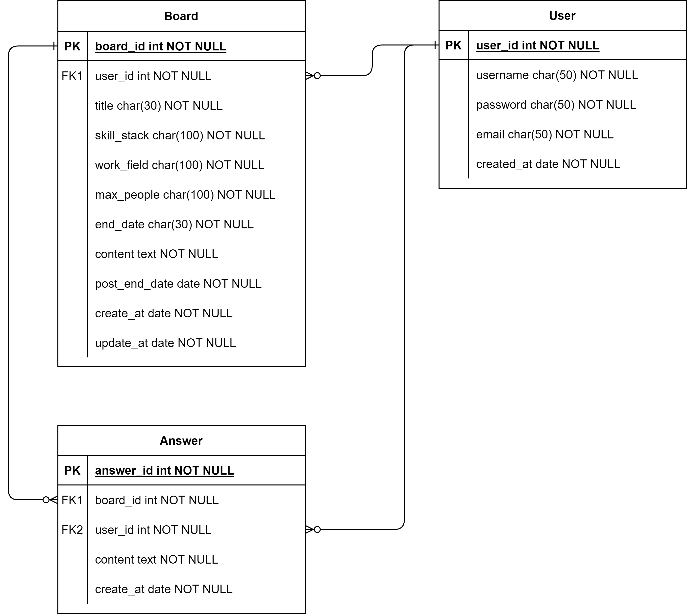

- User - Board : 1명의 유저가 N개의 글을 작성할 수 있으므로 1대 N 관계이다.

- User - Answer : 1명의 유저가 N개의 댓글을 작성할 수 있으므로 1대 N관계이다.

- Board - Answer : 작성된 글 1개에 N개의 댓글을 작성할 수 있으므로 1대 N 관계이다.

### 시스템 아키텍처

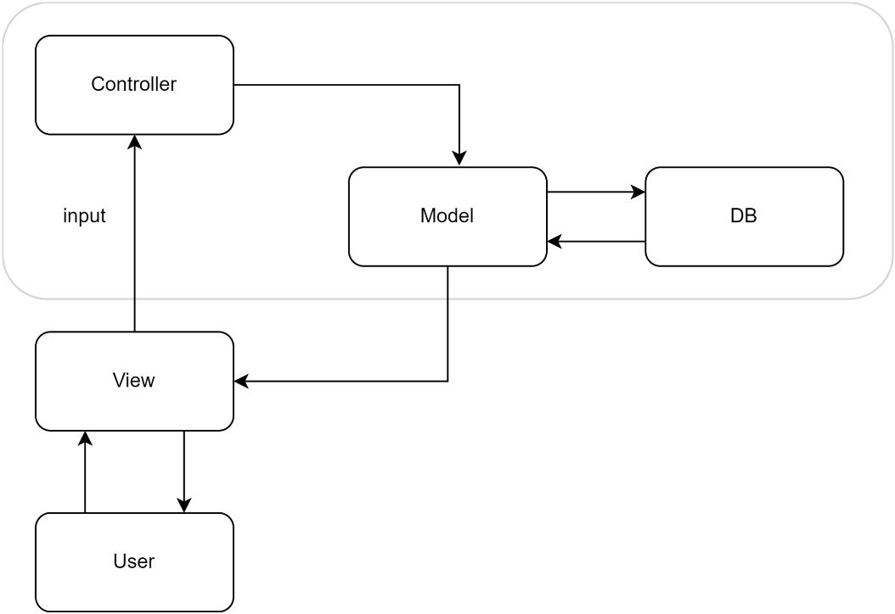

- 전형적인 MVC 패턴으로 일반적인 순서는 User → View → Controller → Model → View → User이다.
- 사용자는 화면을 확인하거나 값을 입력한 경우 해당 값은 Controller에 전달되고, Model에 전달된다. Model에서는 DB의 값을 가져오거나, 입력한 값을 DB에 저장하고 다시 View로 전달한다.

## UI 구성

### 메인 페이지

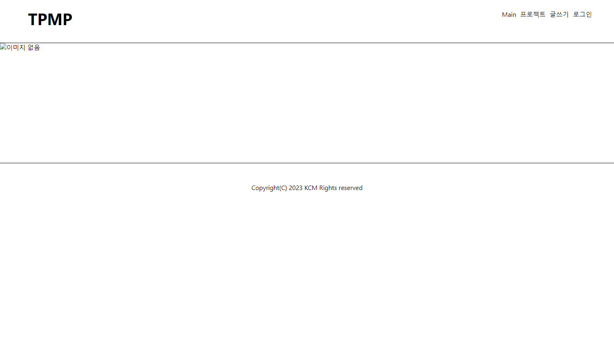

- 메인 페이지에는 중앙에 공지할 수 있는 공간을 두었다.

### 글 생성 페이지

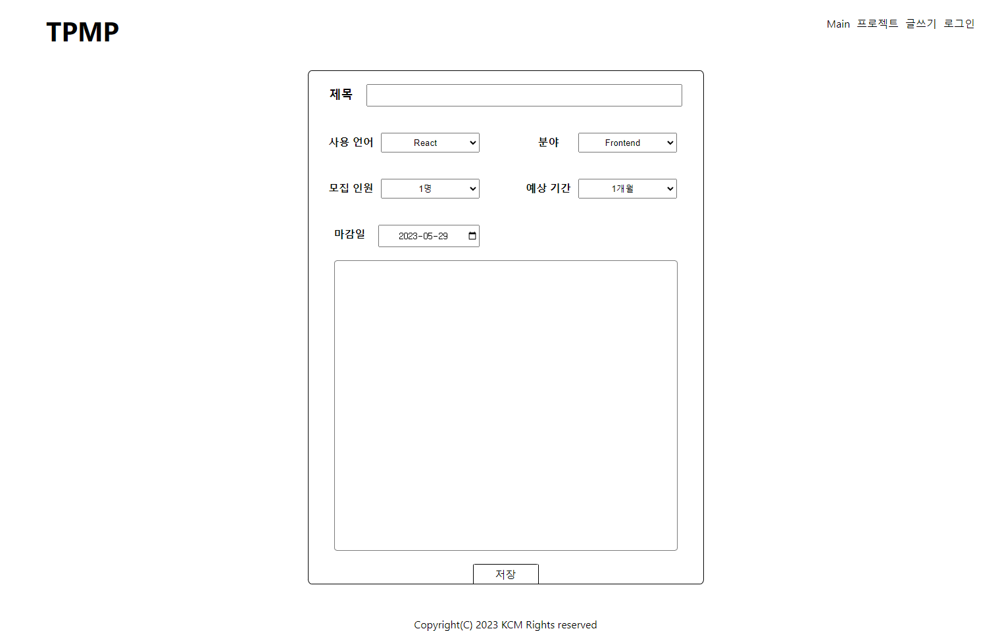

- 생성할 수 있는 칸에는 제목, 사용 언어, 분야, 모집 인원, 예상 기간, 마감일을 두었으며, 저장 버튼을 누른 경우, DB에 저장하도록 하였다.

### 프로젝트 리스트 페이지

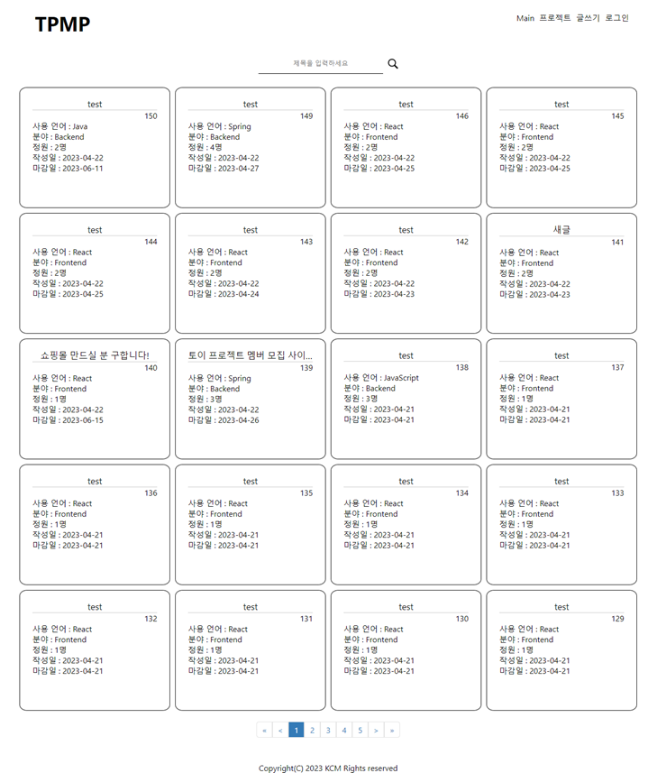

- 제목을 입력한 경우 제목에 해당 단어가 포함된 내용을 출력해준다.
- 한 페이지에 20페이지씩 나타나게 했으며, 아래 버튼을 누르는 경우 해당 페이지에 출력될 내용을 출력한다.

### 글 상세 페이지

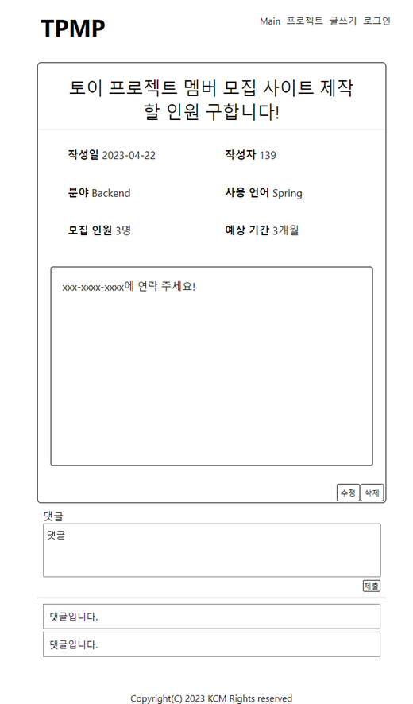

- 프로젝트를 누르는 경우 최상단에 제목을 나타냈으며, 작성일 ,작성자, 분야, 사용 언어, 모집 인원, 예상 기간, 내용을 출력한다.
- 하단에는 댓글창을 두었으며 내용을 입력한 경우, 댓글창 아래에 작성한 내용이 보이게 하였다.
- 삭제 버튼을 누르면, 작성한 글을 삭제할 수 있다.
- 수정 버튼을 누르면, 수정 페이지로 이동한다.

### 글 수정 페이지

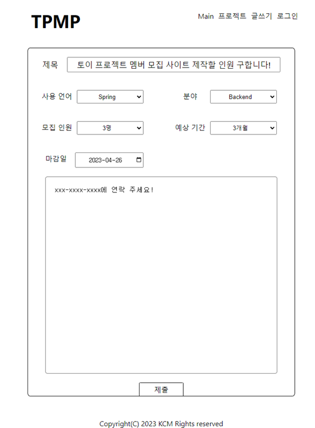

- 수정 페이지에는 상세 페이지에 보였던 내용을 수정할 수 있으며, 제출을 누르면 수정된 내용을 저장한다.

### 로그인 페이지

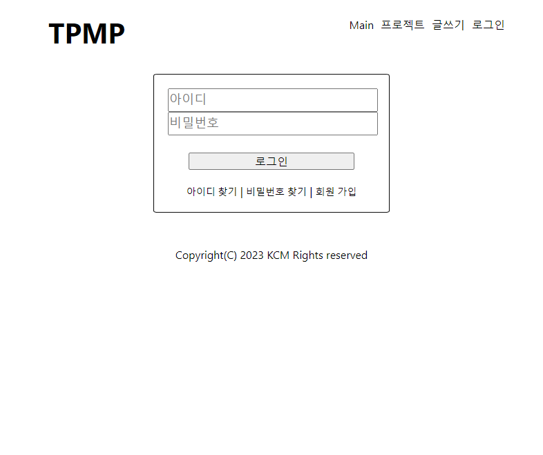

- 아이디와 비밀번호를 입력해서 저장할 수 있다.

### 회원가입 페이지

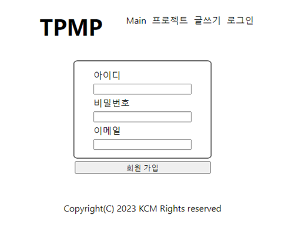

- 아이디, 비밀번호, 이메일을 작성한 다음 회원 가입을 누르면, DB에 내용을 저장한다.

## 🖌️ Backend 구성

### Board

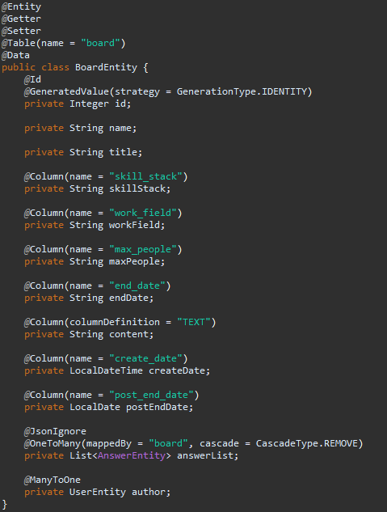

### Answer

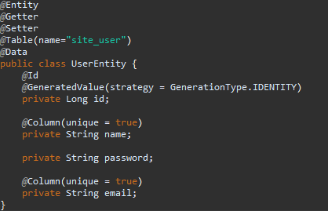

### User

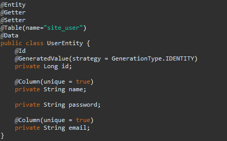

## 📦 기술 스택

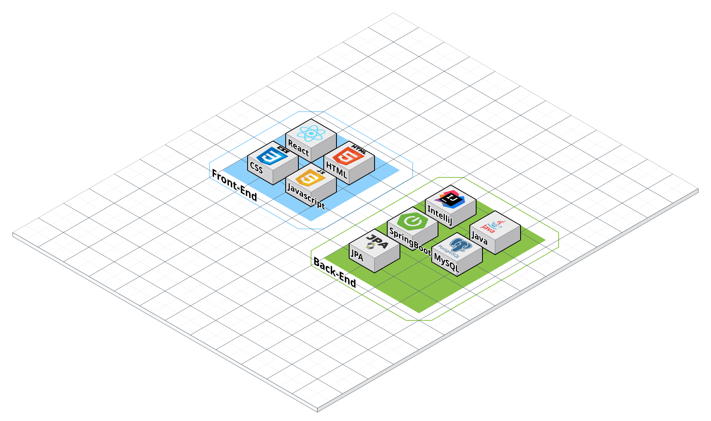

## ⭐ 프로젝트 결과

### 기능 구현 todoList

- [ ]  **메인 화면**
    
    - [x]  네비게이션 + footer
    - [ ]  슬라이드
    - [x]  검색 기능 : 사용 언어로 분류할 수 있게 한다. (~~ex: js, react 클릭 후 검색하면 해당 결과 리스트가 나온다~~.)) option으로 해보고 시간나면 그림을 클릭하는 방향 고려
    
- [x]  **로그인 화면**
    
    - [x]  회원 가입, 아이디 찾기, 비밀번호 찾기 화면 구성

- [ ]  **작성한 글 목록**
    
    - [x]  (각 프로젝트에 사용 언어, 작성 날짜, 분야, 프로젝트 크기, 모집 인원, 답글 수, 글쓴이)
    - [x]  페이지 형태(1, 2, 3 ,4 “5”, 6, 7, 8, 9 10) ⇒ 새로고침하면 맨 처음으로 돌아감
    - [ ]  저장하는 기능 추가
    - [x]  한 페이지에 20개 정도로

- [x]  **작성한 글을 올리는 화면(c)**
    
    - [x]  제목, 사용 언어, 분야, 시작일, 예상 기간, 모집 인원, 내용 등을 입력 받는 양식 작성
        - [x]  각각 select로 입력
    - [x]  제출 버튼 클릭 시 프로젝트 리스트에 올라가게 한다.

- [x]  **작성한 글을 확인하는 화면(r)**
    
    - [x]  작성 날짜, 분야, 사용 언어, 모집 인원, 댓글 수 …
    - [x]  연락 방법이나 모집 분야는 작게 하고, 아래로 내린다.

- [x]  **작성한 글을 수정하는 화면(u)**
    
    - [x]  글을 올리는 화면과 비슷한 구성

- [x]  **작성한 글을 삭제하는 화면(d)**
    
    - [x]  삭제하기 전 삭제 여부 물어보기

### 문제점

1. 기능 구현을 로그인 하는 것까지 구현하긴 했지만, 제 기능을 수행하지 못한다.
2. CSS 디자인이 많이 부족하다.
